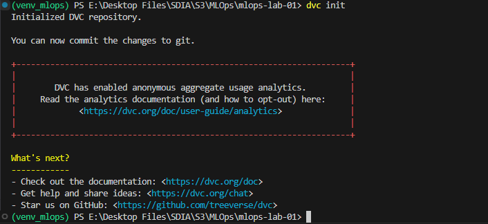

# Compte Rendu - Lab 3 - MLOps

Soufiane MAJDALANE

# **Versionnement des données et pipelines ML avec DVC**

### **Étape 1 : Initialisation de DVC dans le projet**

**initialisation de DVC**

### **Étape 2 : Versionner les données brutes avec DVC**

**Apres session deuppr data/ de votre .gitignore, on ajoute le dataset au suivi DVC**

**Ajoute au versionnement Git :**

### **Étape 3 : Configuration d’un remote DVC**

**Déclaration comme remote principal**

**Versionne la config :**

### **Étape 4 : Push des données dans le remote DVC**

### **Étape 5 : imulation d’une collaboration : supprimer localement et récupérer depuis DVC**

**Suppression du dataset local :**

**Récupèration du dataset via DVC :**

### **Étape 6 : Création d’un pipeline reproductible dvc.yaml**

On a versionné les données transformées et les statistiques d’entraînement avec DVC, en les liant à un commit Git précis.

Remove the file from Git's index

**Création d’un pipeline :**

**Ajoute l'étape d’entraînement :**

**Evaluation du model :**

### **Étape 7 : Reproduire automatiquement tout le pipeline**

